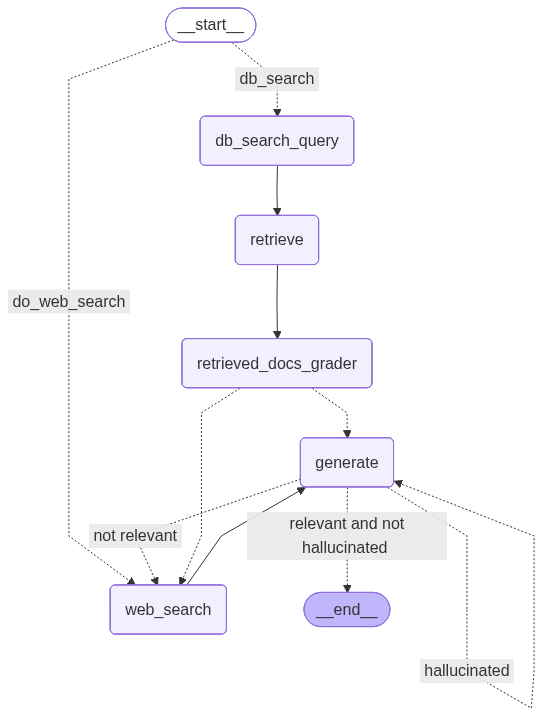

# Agentic-RAG

An Agentic Retrieval-Augmented Generation (RAG) system built with LangGraph that intelligently routes queries between vector database search and web search based on question type.

## Architecture



## Features

- **Smart Routing**: Uses LLM to determine if a question should go to vector DB or web search
- **Hallucination Detection**: Validates generated answers against source documents
- **Relevance Checking**: Ensures answers are relevant to the original question
- **Document Grading**: Filters retrieved documents for relevance before generation
- **Web Search Fallback**: Automatically searches the web when DB results are insufficient

## Project Structure

```
Agentic-RAG/
├── src/
│   ├── graph/
│   │   ├── nodes/           # Graph node functions
│   │   │   ├── db_search_query.py
│   │   │   ├── generate.py
│   │   │   ├── retrieve.py
│   │   │   ├── retrieved_docs_grader.py
│   │   │   └── web_search.py
│   │   ├── chains/          # LLM chain definitions
│   │   │   ├── router.py
│   │   │   ├── search.py
│   │   │   ├── search_db.py
│   │   │   ├── grader.py
│   │   │   ├── hallucination.py
│   │   │   ├── relevance.py
│   │   │   └── generate.py
│   │   ├── state.py        # GraphState definition
│   │   ├── graph.py        # Main graph builder
│   │   └── llm.py          # LLM configuration
│   ├── ingestion.py         # Data loading & vector store creation
│   └── main.py              # Application entry point
├── chroma_db/              # Persistent vector store (gitignored)
├── .env                    # Environment variables (gitignored)
├── pyproject.toml
└── requirements.txt
```

## Prerequisites

- Python >= 3.13
- Groq API key
- HuggingFace API token
- Tavily API key (for web search)

## Installation

1. Clone the repository:
   ```bash
   git clone <repo-url>
   cd Agentic-RAG
   ```

2. Create virtual environment:
   ```bash
   python -m venv .venv
   # Windows:
   .venv\Scripts\activate
   # Linux/Mac:
   source .venv/bin/activate
   ```

3. Install dependencies:
   ```bash
   pip install -r requirements.txt
   # or using uv:
   uv sync
   ```

## Configuration

Create a `.env` file in the root directory:

```env
# LangSmith tracing (optional)
LANGSMITH_TRACING=true
LANGSMITH_ENDPOINT=https://eu.api.smith.langchain.com
LANGSMITH_API_KEY=your_key
LANGSMITH_PROJECT=Agentic-RAG

# Groq LLM (with tool calling)
GROQ_API_KEY=your_groq_key
GROQ_MODEL=openai/gpt-oss-120b
GROQ_MODEL_FAST=llama-3.3-70b-versatile

# HuggingFace Embeddings
HUGGINGFACEHUB_API_TOKEN=your_hf_token

# Tavily Web Search
TAVILY_API_KEY=your_tavily_key

# Python path (for imports)
PYTHONPATH=.
```

**Note**: Enable `python.terminal.useEnvFile` in VS Code settings to automatically load the `.env` file in the terminal.

## Usage

### Running the Application

The main entry point is `src/main.py`. It accepts a question via command-line argument or interactive input.

**Using command-line argument:**
```bash
python -m src.main "What is LangGraph?"
```

**Using interactive input:**
```bash
python -m src.main
# Prompt will appear: Enter your question:
```

This will:
1. Accept your question (via CLI argument or interactive prompt)
2. Route your question to the appropriate search method
3. Retrieve relevant documents
4. Generate an answer
5. Validate for hallucination and relevance
6. Display the final answer

### Running Individual Chains

```bash
# Test document grader
python -m src.graph.chains.grader

# Test web search query generator
python -m src.graph.chains.search

# Test hallucination checker
python -m src.graph.chains.hallucination

# Test relevance checker
python -m src.graph.chains.relevance
```

## Graph Workflow

The system uses a LangGraph state graph with conditional routing:

1. **Router** → Determines if question goes to "web_search" or "db_search"
2. **DB Search Query** → Generates optimized query for vector database
3. **Retrieve** → Fetches relevant documents from Chroma vector store
4. **Document Grader** → Filters documents for relevance (sets `is_web_search` flag)
5. **Generate** → Creates answer from retrieved documents
6. **Hallucination Check** → Validates answer is grounded in documents
7. **Relevance Check** → Ensures answer addresses the question
8. **Conditional Routing** → Loops back to web search if answer is inadequate

### Graph State (GraphState)

```python
class GraphState(TypedDict):
    question: str              # The user's question
    retrieve_query: str        # LLM generated query for vector DB
    generation: str            # The generated answer from LLM
    is_web_search: bool        # If web search is required
    search_queries: List[str]   # List of queries for web search
    documents: List[Document]  # List of documents from vector DB
```

## Data Sources

The vector database is populated from:
- [Lilian Weng's Blog - LLM Powered Autonomous Agents](https://lilianweng.github.io/posts/2023-06-23-agent/)
- [Lilian Weng's Blog - Prompt Engineering](https://lilianweng.github.io/posts/2023-03-15-prompt-engineering/)
- [Lilian Weng's Blog - Adversarial Attacks on LLMs](https://lilianweng.github.io/posts/2023-10-25-adv-attack-llm/)

## Testing

```bash
# Run all tests
python -m pytest

# Run specific test
python -m pytest src/graph/chains/tests/test_chains.py -v
```

## Technologies Used

- **LangGraph** - Graph orchestration
- **LangChain** - Chain building
- **Groq** - LLM provider (gpt-oss-120b, llama-3.3-70b-versatile)
- **HuggingFace** - Embeddings (Qwen3-Embedding-8B)
- **Chroma** - Vector database
- **Tavily** - Web search API

## Troubleshooting

### Running the Application
Use `python -m src.main` to run the application with user input support.

### Import Errors
If you get `ModuleNotFoundError: No module named 'src'`, ensure:
1. You're using `python -m pytest` instead of `pytest`
2. Your `.env` file has `PYTHONPATH=.`
3. VS Code setting `python.terminal.useEnvFile` is enabled

### LLM Tool Calling Errors
If you see errors like `tool call validation failed: expected boolean, got string`:
- The LLM occasionally returns string representations of booleans
- The code includes Pydantic validators to handle type coercion

## License

Apache License 2.0
